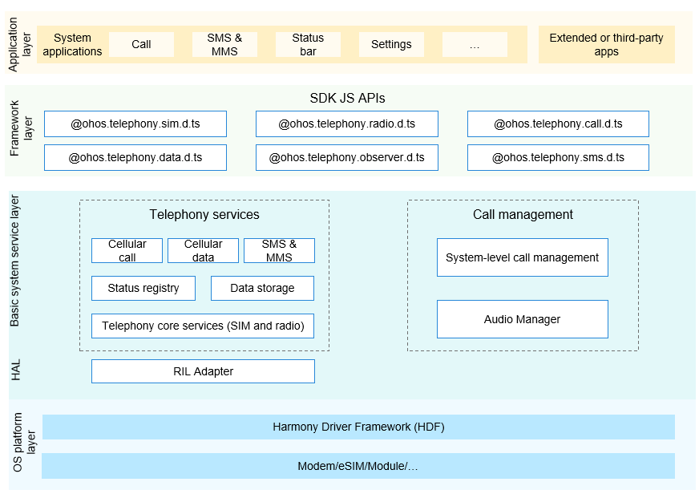

# Telephony <a name="EN-US_TOPIC_0000001162422291"></a>

## Introduction<a name="section104mcpsimp"></a>

The Telephony subsystem provides APIs for obtaining information about the wireless cellular network and SIM card. Applications can call these APIs to obtain information such as the name of the currently registered network, network service status, signal strength, and SIM card information.

The Telephony subsystem consists of the following modules:

-   Telephony core service: initializes the Radio Interface Layer (RIL) Manager, SIM card module, and radio module.
-   Call Manager module: manages three types of calls – circuit switched \(CS\), IP multimedia subsystem \(IMS\), and over the top \(OTT\) calls. It is responsible for applying for the audio and video resources required for a call and resolving conflicts in a multi-channel call.
-   Cellular call module: implements basic calls over carrier networks.
-   Cellular data module: implements cellular data services over carrier networks.
-   SMS & MMS module: provides the capabilities of sending and receiving short message service \(SMS\) messages and encoding and decoding multimedia messaging service \(MMS\) messages.
-   State registry module: provides APIs to register and deregister an observer that listens for various callback events of the telephony subsystem. 
-   Data storage module: stores persistent data and provides **DataAbility** access APIs.
-   RIL Adapter module: implements adaptation of the modem communication interfaces.

**Figure 1** Architecture of the network management subsystem



## Directory Structure<a name="section119mcpsimp"></a>

```
base/telephony/telephony_cangjie_wrapper
├── ohos             # Cangjie Telephony code
├── kit              # Cangjie kit code
├── figures          # architecture pictures
```

## Constraints<a name="section123mcpsimp"></a>

1.  The open-source version currently provides the cellular call (CS call only), SMS & MMS, and cellular data services and supports the dual-SIM framework.
2.  The southbound HDI depends on the chip vendor.

## Repositories Involved<a name="section152mcpsimp"></a>

**Telephony**

telephony_cangjie_wrapper
