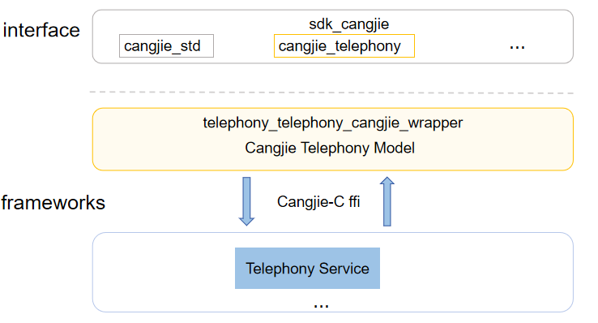

# telephony_cangjie_wrapper

## Introduction

The telephony_cangjie_wrapper is a Cangjie API encapsulated on OpenHarmony based on the capabilities of the Telephony subsystem. Provides call management functions, including making calls, jumping to the dialing interface, obtaining call status, and formatting phone numbers.
The currently open Telephony Cangjie api only supports standard devices.

**Figure 1** Architecture of the telephony_cangjie_wrapper



As shown in the architecture:

- makeCall: Provides the dialing function, the capability to redirect to the call dial interface, and display the phone number to be dialed.
- hasCall, getCallState, hasVoiceCapability, isEmergencyPhoneNumber: Provides the capabilities to determine whether a call is in progress, obtain the current call status, check if the current device supports voice call functionality, and identify whether a number is an emergency phone number.
- formatPhoneNumber, formatPhoneNumberToE164: Provides the capability to format phone numbers.
- Cangjie Telephony FFI interface: Based on cross-language interoperability via C interfaces to implement Telephony Cangjie API.
- call_manager: Responsible for providing basic call management functions, and encapsulates C interfaces for Cangjie to conduct interoperation.

## Directory Structure

```
base/telephony/telephony_cangjie_wrapper
├── figures          # architecture pictures
├── kit              # Cangjie TelephonyKit kit code
│   └── TelephonyKit
├── ohos             # Cangjie Telephony code
│   └── telephony
└── test             # Cangjie Telephony test cases
```

## Constraints

1. The open-source version currently provides the cellular call (CS call only), SMS & MMS, and cellular data services and supports the dual-SIM framework.
2. The southbound HDI depends on the chip vendor.

## Usage Guidelines

The following features are provided:

  - make a phone call

The following features are not provided yet:

  - Cellular Data
  - eSIM Card Management
  - Subscription Management
  - Network Search
  - SIM Card Management
  - Short Message Service (SMS)

For Telephony-related APIs, please refer to [ohos.telephony.call](https://gitcode.com/openharmony-sig/arkcompiler_cangjie_ark_interop/blob/master/doc/API_Reference/source_zh_cn/apis/TelephonyKit/cj-apis-telephony-call.md). For relevant guidance, please refer to [Telephony Development Guide](https://gitcode.com/openharmony-sig/arkcompiler_cangjie_ark_interop/blob/master/doc/Dev_Guide/source_en/telephony/cj-telephony-overview.md).

## Repositories Involved

[call_manager](https://gitee.com/openharmony/telephony_call_manager)

[ability_ability_cangjie_wrapper](https://gitcode.com/openharmony-sig/ability_ability_cangjie_wrapper)

[arkcompiler_cangjie_ark_interop](https://gitcode.com/openharmony-sig/arkcompiler_cangjie_ark_interop)

[hiviewdfx_hiviewdfx_cangjie_wrapper](https://gitcode.com/openharmony-sig/hiviewdfx_hiviewdfx_cangjie_wrapper)

## Code Contribution

Developers are welcome to contribute code, documentation, etc. For specific contribution processes and methods, please refer to [Code Contribution](https://gitcode.com/openharmony/docs/blob/master/en/contribute/code-contribution.md).
