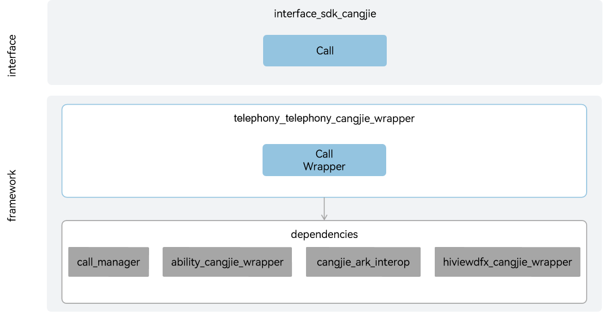

# telephony_telephony_cangjie_wrapper

## Introduction

The telephony_telephony_cangjie_wrapper is a call management capability provided on OpenHarmony for developers who use the Cangjie programming language to develop applications. Developers can use this capability to make phone calls, obtain call status, and format phone numbers.
The currently open telephony_telephony_cangjie_wrapper only supports standard devices.

## System Architecture

**Figure 1** telephony_cangjie_wrapper architecture



As shown in the architecture diagram:

Interface Layer:

- makeCall: Provides dialing function, the capability to jump to the dialing interface, and display the number to be dialed.
- acquire call attribution: Offers developers the ability to determine if there is an ongoing call, obtain the current call status, check if the current device supports voice call functionality, and identify emergency phone numbers.
- formatPhoneNumber: Supplies developers with the capability to format phone numbers.

Framework Layer:
- makeCall wrapper: Implements dialing functionality based on the system call management capabilities of the underlying call_manager, navigating to the dialing interface and displaying the called number.
- attribution-related function wrapper: Realizes the ability to obtain call attributes based on the system call management capabilities of the underlying call_managemer.
- formatPhoneNumber wrapper: Achieves phone number formatting capabilities based on the system call management capabilities of the underlying call management. The formatted numbers comply with standard digital strings or E.164 representation formats.

Dependencies Introduction in Architecture:

- call_manager: Relies on the system call management capabilities of call management to handle call downlink operations (such as dialing, answering, hanging up, etc.) and uplink statuses (incoming call status, call waiting status, etc.), and resolve conflicts arising during calls.
- ability_cangjie_wrapper: Dialing depends on the application context capability provided by ability_cangjie_wrapper for navigating to the dialing interface during dialing.
- hiviewdfx_cangjie_wrapper: Depends on HiLog capabilities for printing logs at key points.
- cangjie_ark_interop: Depends on APILevel class definitions and BusinessException class definitions for API annotation and throwing exceptions to users in error branches.

## Directory Structure

```
base/telephony/telephony_cangjie_wrapper
├── figures          # architecture pictures
├── kit              # Cangjie TelephonyKit kit code
│   └── TelephonyKit # TelephonyKit module implementation
├── ohos             # Cangjie telephony service interface implementation
│   └── telephony    # Telephony module
│       └── call     # Call management module
└── test             # Cangjie telephony service test cases
    └── telephony_call # Call management test cases
```

## Usage

As shown in the architecture diagram, the telephony_telephony_cangjie_wrapper provides the following functional interfaces. Developers can comprehensively use one or more types of interfaces according to their needs:

  - Make phone calls.

For telephony related APIs, please refer to [ohos.telephony.call](https://gitcode.com/openharmony-sig/arkcompiler_cangjie_ark_interop/blob/master/doc/API_Reference/source_en/apis/TelephonyKit/cj-apis-telephony-call.md). For related guidelines, please refer to: [Make a Phone Call](https://gitcode.com/openharmony-sig/arkcompiler_cangjie_ark_interop/blob/master/doc/Dev_Guide/source_en/telephony/cj-telephony-call.md).

## Constraints

The device to be equipped requires hardware support including a speaker or earpiece, a microphone, and also needs an inserted SIM card.

Compared to ArkTS API, the following functions are not supported:

  - Cellular Data
  - eSIM Card Management
  - Subscription Management
  - Network Search
  - SIM Card Management
  - Short Message Service (SMS)

## Code Contribution

Developers are welcome to contribute code, documentation, etc. For specific contribution processes and methods, please refer to [Code Contribution](https://gitcode.com/openharmony/docs/blob/master/en/contribute/code-contribution.md).

## Repositories Involved

[ability_ability_cangjie_wrapper](https://gitcode.com/openharmony-sig/ability_ability_cangjie_wrapper)

[arkcompiler_cangjie_ark_interop](https://gitcode.com/openharmony-sig/arkcompiler_cangjie_ark_interop)

[hiviewdfx_hiviewdfx_cangjie_wrapper](https://gitcode.com/openharmony-sig/hiviewdfx_hiviewdfx_cangjie_wrapper)

[telephony_call_manager](https://gitcode.com/openharmony/telephony_call_manager)