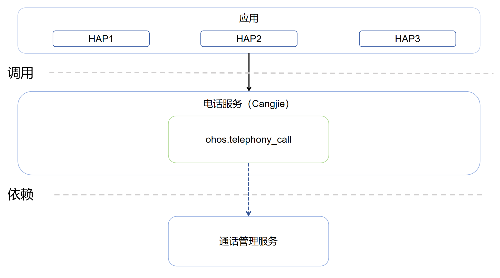

# 电话服务仓颉接口

## 简介

电话服务仓颉接口是在OpenHarmony上基于电话服务子系统能力之上封装的仓颉API，提供呼叫管理功能，包括拨打电话、跳转到拨号界面、获取通话状态、格式化电话号码。
当前开放的电话服务仓颉接口仅支持standard设备。

## 系统架构

**图 1**  电话服务仓颉架构图



如架构图所示：

- 跳转拨号界面接口：提供拨号功能，跳转到拨号界面，并显示待拨出的号码的能力。
- 获取通话属性接口：提供判断是否存在通话，获取当前通话状态，检查当前设备是否具备语音通话能力以及判断是否是紧急电话号码的能力。
- 格式化电话号码接口：提供格式化电话号码的能力。
- 仓颉电话服务FFI接口定义：负责定义C语言互操作仓颉接口，用于实现电话服务的能力。
- 通话管理服务：负责提供通话管理基础功能，封装C语言接口提供给仓颉进行互操作。

## 目录

```
base/telephony/telephony_cangjie_wrapper
├── figures          # 存放README中的架构图
├── kit              # 仓颉TelephonyKit的kit化代码
│   └── TelephonyKit # TelephonyKit模块实现
├── ohos             # 仓颉电话服务接口实现
│   └── telephony    # 电话服务模块
│       └── call     # 呼叫管理模块
└── test             # 测试用例
    └── APILevel21
        └── telephony_call # 呼叫管理测试用例
```

## 使用说明

如架构图所示，电话服务仓颉接口提供了以下功能接口：

  - 拨打电话。

与ArkTS提供的API能力相比，暂不支持以下功能：

  - 蜂窝数据。
  - eSIM卡管理。
  - 订阅管理。
  - 网络搜索。
  - SIM卡管理。
  - 短信服务。

电话服务相关接口请参见[电话服务API文档](https://gitcode.com/openharmony-sig/arkcompiler_cangjie_ark_interop/blob/master/doc/API_Reference/source_zh_cn/apis/TelephonyKit/cj-apis-telephony-call.md)，相关开发指导请参见[拨打电话](https://gitcode.com/openharmony-sig/arkcompiler_cangjie_ark_interop/blob/master/doc/Dev_Guide/source_zh_cn/telephony/cj-telephony-call.md)。

## 参与贡献

欢迎广大开发者贡献代码、文档等，具体的贡献流程和方式请参见[参与贡献](https://gitcode.com/openharmony/docs/blob/master/zh-cn/contribute/%E5%8F%82%E4%B8%8E%E8%B4%A1%E7%8C%AE.md)。

## 相关仓

[ability_ability_cangjie_wrapper](https://gitcode.com/openharmony-sig/ability_ability_cangjie_wrapper)

[arkcompiler_cangjie_ark_interop](https://gitcode.com/openharmony-sig/arkcompiler_cangjie_ark_interop)

[hiviewdfx_hiviewdfx_cangjie_wrapper](https://gitcode.com/openharmony-sig/hiviewdfx_hiviewdfx_cangjie_wrapper)

[telephony_call_manager](https://gitcode.com/openharmony/telephony_call_manager)
