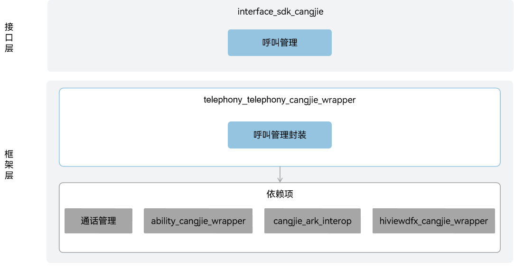

# 电话服务仓颉接口

## 简介

电话服务仓颉接口是在 OpenHarmony 上基于电话服务子系统能力之上封装的仓颉API，提供呼叫管理功能，包括拨打电话、跳转到拨号界面、获取通话状态、格式化电话号码。

## 系统架构

**图 1**  电话服务仓颉架构图



## 目录

全球化仓颉源代码在/base/telephony/telephony_cangjie_wrapper目录下。

```
base/telephony/telephony_cangjie_wrapper
├── ohos             # 仓颉电话服务接口实现
├── kit              # 仓颉kit化代码
├── figures          # 存放readme中的架构图
```

## 约束

1.  目前开源的范围包括蜂窝通话（仅支持CS通话）、短信、数据上网，支持双SIM卡框架。
2.  南向HDI依赖芯片厂商适配。
3.  当前开放的电话服务仓颉接口仅支持standard设备

## 使用说明

如架构图所示，全球化仓颉接口提供了以下功能接口，开发者可以根据使用诉求，综合使用一类或多类接口：

  - 拨打电话。

与ArkTS相比，暂不支持以下功能：

  - 蜂窝数据。
  - eSIM卡管理。
  - 订阅管理。
  - 网络搜索。
  - SIM卡管理。
  - 短信服务。

电话服务相关API请参见[ohos.telephony.call](https://gitcode.com/openharmony-sig/arkcompiler_cangjie_ark_interop/blob/master/doc/API_Reference/source_zh_cn/apis/TelephonyKit/cj-apis-telephony-call.md)，相关指导请参见：[拨打电话](https://gitcode.com/openharmony-sig/arkcompiler_cangjie_ark_interop/blob/master/doc/Dev_Guide/source_zh_cn/telephony/cj-telephony-call.md)。

## 相关仓

[call_manager](https://gitee.com/openharmony/telephony_call_manager)

## 参与贡献

欢迎广大开发者贡献代码、文档等，具体的贡献流程和方式请参见[参与贡献](https://gitcode.com/openharmony/docs/blob/master/zh-cn/contribute/%E5%8F%82%E4%B8%8E%E8%B4%A1%E7%8C%AE.md)。
